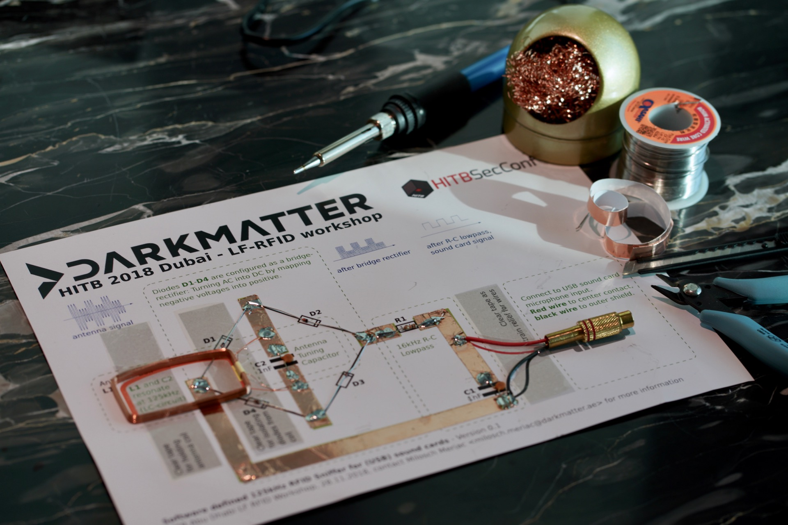
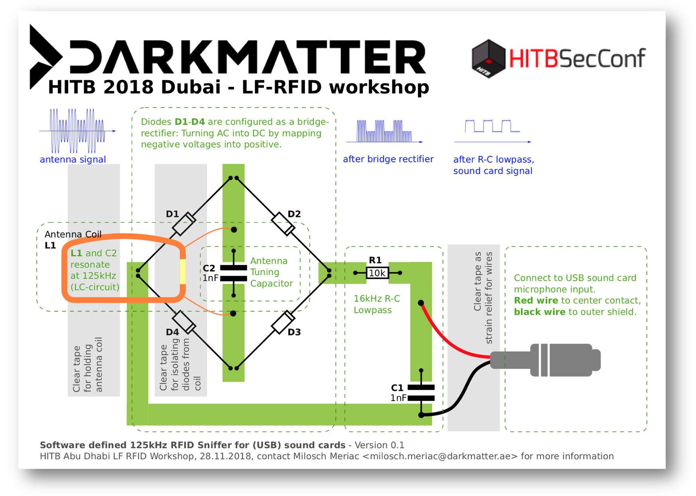

# Low-Frequency RFID Hacking Workshop & Deep Dive

## Summary
As part of the [Hack In The Box](https://conference.hitb.org/hitbsecconf2018dxb/) security conference in Dubai 2018 [DarkMatter Xen1thLabs](https://www.darkmatter.ae/xen1thlabs/xen1th-aboutus/) is presenting a new tool for teaching RFID security. Stundents can [print out an RFID sniffer circuit](../../raw/master/docs/darkmatter-rfid-sniffer.pdf) on thick paper (180g or more) with a common printer - and then use adhesive coper tape and a few simple electronic parts to complete the functioning circuit for sniffing and reverse engineering RFID-tag/reader communications.

To avoid purchasing of expensive tools like oscilloscopes, the circuit output is compatible with a microphone input as available on many desktop PCBs or [sub-$5 USB sound cards](https://www.aliexpress.com/item//32721660686.html) - but any (USB) sound card should do.

## Parts Lists

### Flexile RFID Sniffer Parts
All parts are through-hole (wired) for simple soldering. Please ensure to cover all green areas on a [printed paper](../../raw/master/docs/darkmatter-rfid-sniffer.pdf) with uninterrupted copper tape. Sticky tape is used to hold the reader coil in place, to act as a strain-relief for the sound card connector and as an isolation between diodes and the coil.

- Thick A4 sized paper (ideally 180g or thicker)
- **R1**: 10kΩ resistor
	- 4-ring resistors: Brown-Black-Orange-*X*
	- 5-ring resistors: Brown-Black-Black-Red-*X*
- **C1**, **C2**: 1nF ceramic capacitor
	- This capacitor has the number *102* printed on it (indicating 1000pF which equals 1nF).
- **D1**, **D2**, **D3**, **D4**: Small-signal Schottky diodes (BAT43 or BAT86 - any small-signal Schottky diode should do).
- **L1**: Reader antenna coil 1.62uH (provided in the workshop, stay tuned for howto-build tutorial)
- 10mm wide adhesive copper tape
- 24mm wide clear sticky tape 
 

## Paper-PCB Layout
You can [download and print](../../raw/master/docs/darkmatter-rfid-sniffer.pdf) the layout below:

